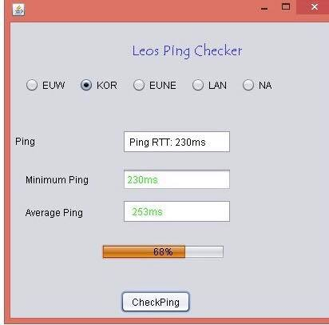

# Multithreaded LoL-Ping-Checker

A Simple League of Legends multithreaded  ping checker that uses InetAddress to accurately determine ping.
Client pings the server 100 times to get an average ping and determine the max and minimum ranges.

#Features

-Ping Checker (Max, Min, Average)

-IP Checker 

- Ping  text color

-Supports 5 servers

Download   https://github.com/LeoBogod22/Java-LoL-ping-checker/blob/master/selenium.jar

